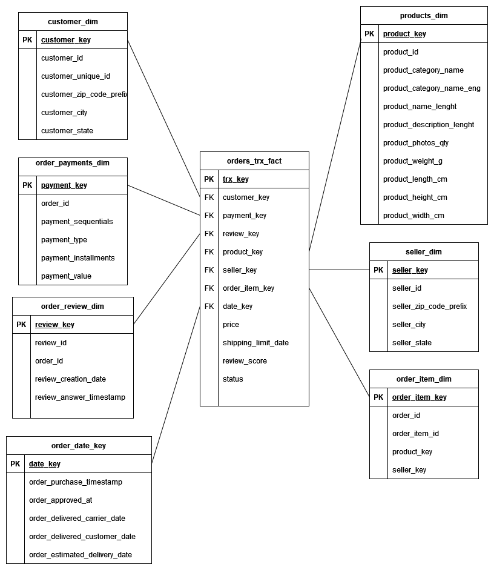

# Data Engineering Capstone Project

### Project Summary

* This project aims to build datawarehouse (star schema) consists fact table and dimensions tables to be able to make far analysis and reporting and dashboards. 
    * so we can answer a questions like which product category has a large number of orders due to specified year?
    * how reviews can affect in product selling? etc..
* I've userd Ecommerce data by Olist store what I've liked that is real commercial data, has a 100k orders and also a wide range of time for better analysis from 2016 to 2018.
* Data URL: https://www.kaggle.com/datasets/olistbr/brazilian-ecommerce?resource=download
* Using Apache spark for processing and handling data cleaning and writing data final output in a files (parquet).

### Data dictionary:- 

* olist_customers_dataset.csv --> This dataset has information about the customer and its location
* olist_order_items_dataset.csv --> This dataset includes data about the items purchased within each order.
* olist_order_payments_dataset.csv --> This dataset includes data about the orders payment options.
* olist_order_reviews_dataset.csv --> This dataset includes data about the reviews made by the customers.
* olist_orders_dataset.csv --> This is the core dataset.
* olist_products_dataset.csv --> This dataset includes data about the products sold by Olist.
* olist_sellers_dataset.csv --> This dataset includes data about the sellers that fulfilled orders made at Olist.
* product_category_name_translation.csv --> Category Name Translation to ENG

<b><i>customers data</i></b>

<table class="tg" align="left">
  <tr>
    <th class="tg-0pky">Column</th>
    <th class="tg-0pky">Description</th>
  </tr>
 <tr><td class="tg-0pky">customer_id</td><td class="tg-0pky">customer id</td>
 <tr><td class="tg-0pky">customer_unique_id</td><td class="tg-0pky">unique customer id accross all data</td>
 <tr><td class="tg-0pky">customer_zip_code_prefix</td><td class="tg-0pky">zip code</td>
 <tr><td class="tg-0pky">customer_city</td><td class="tg-0pky">customer city</td>
 <tr><td class="tg-0pky">customer_state</td><td class="tg-0pky">customer state</td>
</table>

<b><i>Order items data</i></b>

<table class="tg" align="left">
  <tr>
    <th class="tg-0pky">Column</th>
    <th class="tg-0pky">Description</th>
  </tr>
 <tr><td class="tg-0pky">order_id</td><td class="tg-0pky">order id</td>
 <tr><td class="tg-0pky">order_item_id</td><td class="tg-0pky">unique id for each item in the order</td>
 <tr><td class="tg-0pky">product_id</td><td class="tg-0pky">product unique identifier</td>
 <tr><td class="tg-0pky">seller_id</td><td class="tg-0pky">seller unique identifier</td>
 <tr><td class="tg-0pky">shipping_limit_date</td><td class="tg-0pky">seller shipping limit date</td>
 <tr><td class="tg-0pky">price</td><td class="tg-0pky">item price</td>
 <tr><td class="tg-0pky">freight_value</td><td class="tg-0pky">freight</td>
</table>

<b><i>Order payments data</i></b>

<table class="tg" align="left">
  <tr>
    <th class="tg-0pky">Column</th>
    <th class="tg-0pky">Description</th>
  </tr>
 <tr><td class="tg-0pky">order_id</td><td class="tg-0pky">order id</td>
 <tr><td class="tg-0pky">payment_sequential</td><td class="tg-0pky">sequention num of payment</td>
 <tr><td class="tg-0pky">payment_installments</td><td class="tg-0pky">number of months to installment</td>
 <tr><td class="tg-0pky">payment_value</td><td class="tg-0pky">Value or amount of payment</td>
</table>

<b><i>Order Reviews data</i></b>

<table class="tg" align="left">
  <tr>
    <th class="tg-0pky">Column</th>
    <th class="tg-0pky">Description</th>
  </tr>
 <tr><td class="tg-0pky">review_id</td><td class="tg-0pky">unique review identifier</td>
 <tr><td class="tg-0pky">order_id</td><td class="tg-0pky">unique order identifier</td>
 <tr><td class="tg-0pky">review_score</td><td class="tg-0pky"> 1 to 5 given satisfaction survey</td>
 <tr><td class="tg-0pky">review_comment_title</td><td class="tg-0pky">Comment title</td>
 <tr><td class="tg-0pky">review_comment_message</td><td class="tg-0pky">Comment message</td>
 <tr><td class="tg-0pky">review_creation_date</td><td class="tg-0pky">date satisfaction survey sent to customer</td>
 <tr><td class="tg-0pky">review_answer_timestamp</td><td class="tg-0pky">satisfaction survey answer timestamp</td>
</table>

<b><i>Order data</i></b>

<table class="tg" align="left">
  <tr>
    <th class="tg-0pky">Column</th>
    <th class="tg-0pky">Description</th>
  </tr>
 <tr><td class="tg-0pky">order_id</td><td class="tg-0pky">unique identifier of the order.</td>
 <tr><td class="tg-0pky">customer_id</td><td class="tg-0pky">Each order has a unique customer_id</td>
 <tr><td class="tg-0pky">order_status</td><td class="tg-0pky">Reference to the order status (delivered, shipped, etc).</td>
 <tr><td class="tg-0pky">order_purchase_timestamp</td><td class="tg-0pky">Shows the purchase timestamp.</td>
 <tr><td class="tg-0pky">order_approved_at</td><td class="tg-0pky"> payment approval timestamp.</td>
 <tr><td class="tg-0pky">order_delivered_carrier_date</td><td class="tg-0pky">order posting timestamp</td>
 <tr><td class="tg-0pky">order_delivered_customer_date</td><td class="tg-0pky">Shows the actual order delivery date to the customer</td>
 <tr><td class="tg-0pky">order_estimated_delivery_date</td><td class="tg-0pky">Shows the estimated delivery date</td>
</table>

<b><i>products data</i></b>

<table class="tg" align="left">
  <tr>
    <th class="tg-0pky">Column</th>
    <th class="tg-0pky">Description</th>
  </tr>
 <tr><td class="tg-0pky">product_id</td><td class="tg-0pky">unique product identifier</td>
 <tr><td class="tg-0pky">product_category_name</td><td class="tg-0pky">root category of product</td>
 <tr><td class="tg-0pky">product_name_lenght</td><td class="tg-0pky">number of characters extracted from the product name</td>
 <tr><td class="tg-0pky">product_description_lenght</td><td class="tg-0pky">number of characters extracted from the product description.</td>
 <tr><td class="tg-0pky">product_photos_qty</td><td class="tg-0pky">number of product published photos</td>
 <tr><td class="tg-0pky">product_weight_g</td><td class="tg-0pky">product weight measured in grams.</td>
 <tr><td class="tg-0pky">product_length_cm</td><td class="tg-0pky">product length measured in centimeters.</td>
 <tr><td class="tg-0pky">product_height_cm</td><td class="tg-0pky">product height measured in centimeters.</td>
 <tr><td class="tg-0pky">product_width_cm</td><td class="tg-0pky">product width measured in centimeters.</td>
</table>

<b><i>sellers data</i></b>

<table class="tg" align="left">
  <tr>
    <th class="tg-0pky">Column</th>
    <th class="tg-0pky">Description</th>
  </tr>
 <tr><td class="tg-0pky">seller_id</td><td class="tg-0pky">seller unique identifier</td>
 <tr><td class="tg-0pky">seller_zip_code_prefix</td><td class="tg-0pky">first 5 digits of seller zip code</td>
 <tr><td class="tg-0pky">seller_city</td><td class="tg-0pky">seller city name</td>
 <tr><td class="tg-0pky">seller_state</td><td class="tg-0pky">seller state</td>
</table>

<b><i>translations lookup data</i></b>

<table class="tg" align="left">
  <tr>
    <th class="tg-0pky">Column</th>
    <th class="tg-0pky">Description</th>
  </tr>
 <tr><td class="tg-0pky">product_category_name</td><td class="tg-0pky">category name in Portuguese</td>
 <tr><td class="tg-0pky">product_category_name_english</td><td class="tg-0pky">category name in English</td>
</table>

### Explorations (preprocessing steps)
    1- Getting percentage of null values in each column
    2- Dropping null colummns that have too much nulls
    3- Dropping duplicates rows based on primary keys

### Data Model 
#### Star Schema model:

* Dimension tables:- 
    * customer_dim 
    * order_payments_dim    
    * order_review_dim
    * order_date_key
    * product_dim
    * seller_dm
    * order_item_dim
* Fact table:-     
    * order_trx_fact

  

### ETL Steps 
    1- Adding Surrogate key to all dimension tables, because primary keys are natural keys too long ch to be primary keys.
    2- creating dimensions tables: customer_dim ,order_payments_dim,order_review_dim
        ,order_date_key,product_dim,seller_dm,order_item_dim
    3- creating fact table: order_trx_fact
    4- Doing the transformations needed on the dataframes to structure the tables
    5- loading to s3 bucket as parquet files.

### Data Quality 
    By checking in Redshift total number of records for each table if it < 1 so tables are empty so we can trigger an action later.
     like sending notifications. 

### Q&A
* I've used mainly Pyspark for processing so we can able to scale, and distribute the processing on multiple nodes (dynamically) using the configurations
with larger data we can scale up machines, Redshift for DWH, writting final output files to S3 AWS so we can load it into the tables on redshift.
* data is transactional so it should be daily ETL jobs running We can use Apache Airflow to schedule the jobs every 24H to run taking the file and process it then load in Redshift table, here we should partition by day so we can have history.
What If?

 * The data was increased by 100x: the processing is using pyspark so we can increase number of nodes (instances) which by means scalling the cluster up.
 * The data populates a dashboard that must be updated on a daily basis by 7am every day: Using apache Airflow to do the ETL pipelines then we can create a views so it could be auto refreshed on the tables on RedShift
 * The database needed to be accessed by 100+ people: by using scalable datawarehouse like Redshift so we can scale and serve more clients.
