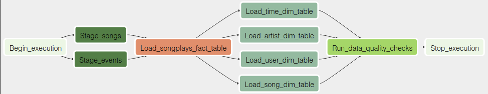

# Project:  Data Pipelines with Apache-Airflow Udacity

# Project Introduction

This project combines song listen log files with song metadata to facilitate analytics.
JSON data are in AWS S3, and by making ETL data pipeline using Apache airflow data stages into Redshift before inserting data into suitable tables for analysis.
The end result is a Redshift cluster with data organized into a star schema with fact and dimension tables.
Analytics queries on the songplays fact table are straightforward, and additional fields can be easily accessed in the four dimension tables users, songs, artists, and time. A star schema is suitable for this application since denormalization is easy, queries can be kept simple, and aggregations are fast.


# Song Dataset

The first dataset is a subset of real data from the Million Song Dataset. Each file is in JSON format and contains metadata about a song and the artist of that song. The files are partitioned by the first three letters of each song's track ID. For example, here are filepaths to two files in this dataset.

```
song_data/A/B/C/TRABCEI128F424C983.json
song_data/A/A/B/TRAABJL12903CDCF1A.json
```

And below is an example of what a single song file, TRAABJL12903CDCF1A.json, looks like.

`{"num_songs": 1, "artist_id": "ARJIE2Y1187B994AB7", "artist_latitude": null, "artist_longitude": null, "artist_location": "", "artist_name": "Line Renaud", "song_id": "SOUPIRU12A6D4FA1E1", "title": "Der Kleine Dompfaff", "duration": 152.92036, "year": 0}`

# Log Dataset

The second dataset consists of log files in JSON format generated by this event simulator based on the songs in the dataset above. These simulate activity logs from a music streaming app based on specified configurations.

The log files in the dataset we'll be working with are partitioned by year and month. For example, here are filepaths to two files in this dataset.

```
log_data/2018/11/2018-11-12-events.json
log_data/2018/11/2018-11-13-events.json
```

**DAG**


# Execution

1. Create Amazon Redshift database.

2. Run `create_tables.sql` to create the tables.

3. Run `etl_task.py` to process the entire datasets.
